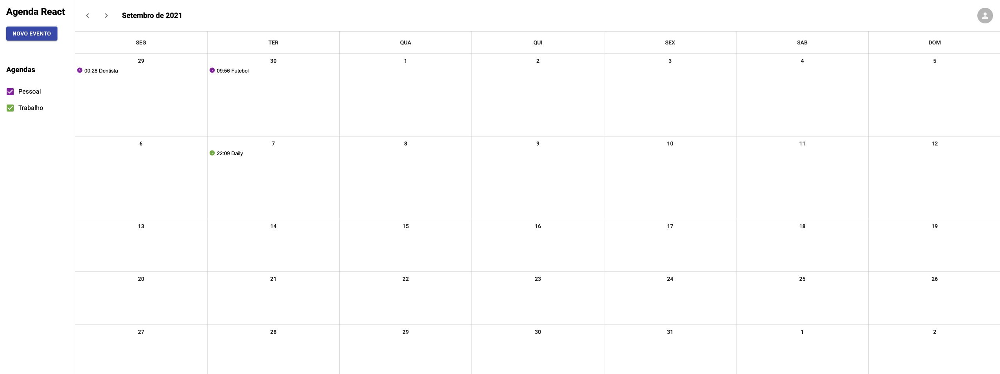

# React Agenda
O projeto react agenda é uma aplicação que foi realizado no bootcamp da IGTI.

### Tela Inicial da aplicação


### Tela do calendário


## Tecnologias
- React
- CRA
- Typescript
- Context Api
- Sass
- Axios
- Json server

## Autenticação

```bash
Email: admin@admin.com
Senha: 1234
```


## Comandos

Instalação:

```bash
npm install
# or
yarn
```

Ambiente de desenvolvimento:

```bash
npm run dev
# or
yarn dev
```

Ambiente de produção:

```bash
npm run start
# or
yarn start
```

Comando para geração build do projeto:

```bash
npm run build
# or
yarn build
```

